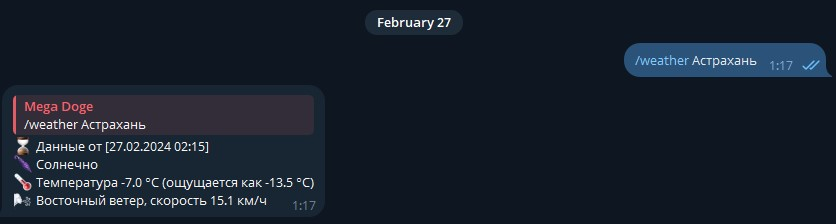

### SK Weather Bot

Telegram-бот для получения актуальных сведений о погодных условиях в указанном городе


### Команды

- #### Запуск `/start`
  - Запуск бота.
- #### Получение данных о погоде в конкретном городе `/weather {город}`
  - В ответ придет сообщение с данными о текущей погоде в указанном городе.

### Установка

1. Склонировать проект
2. Создать и активировать виртуальное окружение

```
python -m venv venv && .\venv\Scripts\activate
```

3. Установить пакеты из `requirements.txt`

```
pip install -r requirements.txt
```

4. Скопировать `.env.example` как `.env`
5. Заполнить `.env`
6. Запустить бота командой

```
python .\main.py
```

### Weather API

Решение использует API сервиса https://www.weatherapi.com/
